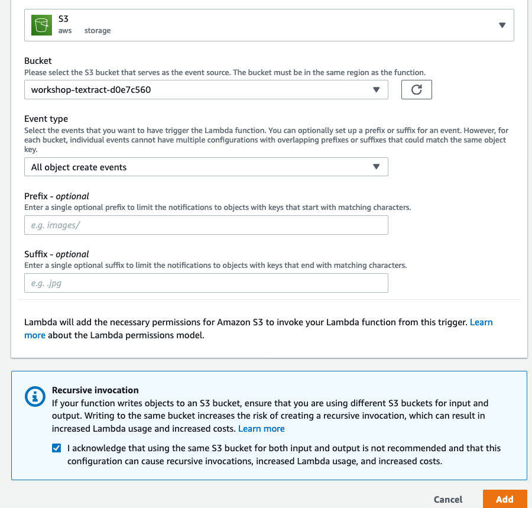

[<<<< Back to workshop](../README.md)

# LAB 0 - Setup the environment

## AWS Cloudformation

AWS Cloudformation provides the ability to describe and provision the infrastucture resources on AWS. Thanks to template files (Infrastructure as code), we will deploy 'Stacks' (a stack is a set of resources that work together to achieve something).

To setup the initial environment, click on launch stack button with your prefered region:

Region | Button
------------ | -------------
us-east-1 | 
eu-west-1 | 
ap-southeast-1 | 

- In step 1, we'll use a template already available in Amazon S3. just click **Next** in the bottom.
- In step 2, provide a name to your stack. We don't have any parameters. Click **Next** in the bottom.
- In step 3, we don't need to fill anything, just click **Next** in the bottom.
- Finally in step 4, you can review everything and check the box **"I acknowledge that AWS CloudFormation might create IAM resources."** and click **Create stack**.

Wait a minute to let Cloudformation create your resources (you can refresh the Events to see the evolution).

Once it's done, you can see all resources created by the CloudFormation stack in [AWS CloudFormation Console](https://console.aws.amazon.com/cloudformation/home). You should get the following ressources:

- *DocumentTextract* is the AWS Lambda function that will get called when a file is uploaded in the *InputS3Bucket*. 
- *LambdaExecutionRole* is an IAM Role that provides the permissions to use Cloudwatch (logs), S3 and Textract for the Lambda.
- *ElasticLibs* is a set of dependencies we'll use in Lab 3 to manipulate Elasticsearch.

## Complete the setup
In order to trigger the process when a document is uploaded in S3, we need to configure an event notification for the ingestion bucket ([doc](https://docs.aws.amazon.com/AmazonS3/latest/user-guide/enable-event-notifications.html)):

1. In the [Lambda console](https://console.aws.amazon.com/lambda/home), click on your *documentTextract-xyz* function. Click on the 'Add Trigger' button

2. Scroll down to "Event notifications" and choose "Create event notification", then fill as follow. Thus, each time an object is created, the Lambda function will be triggered:

## LAB 1
In Lab 1, we will start coding the Lambda function to launch Amazon Textract with the documents uploaded in the S3 bucket.

Textract provides two ways to process documents:
 
 - [Synchronously](https://docs.aws.amazon.com/textract/latest/dg/sync-calling.html), to analyze single-page documents (JPEG, PNG) and for applications where latency is critical. 
 - [Asynchronously](https://docs.aws.amazon.com/textract/latest/dg/api-async.html), when you want to analyze PDF or multipage documents. 

This lab provides step-by-step instructions for each solution. It's time to select the path you want to follow:

- [Lab 1a - The synchronous way](../synchronous/Lab1/README.md) (~ 1h00)
- [Lab 1b - The asynchronous one](../asynchronous/Lab1/README.md).  This version involves keeping track of Textract processing jobs through SNS and a second Lambda function, which takes a bit longer to setup (~ 1h30).

This is a two-ways door, you'll be able to do both if you're interested to see both (start with synchronous option in that case).
